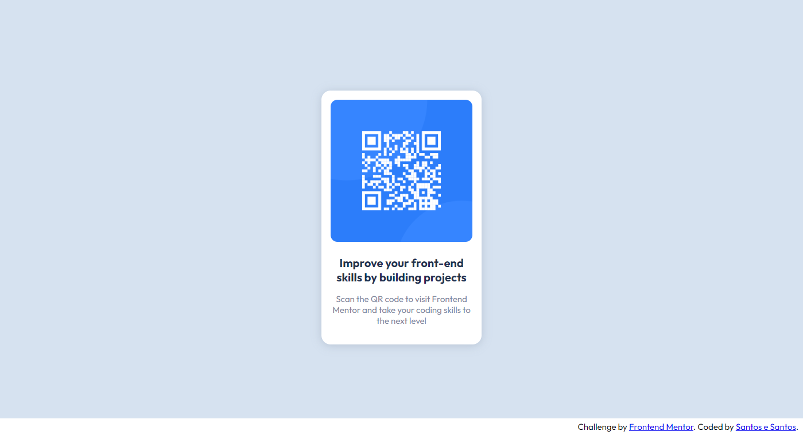

# Frontend Mentor - QR code component solution

This is a solution to the [QR code component challenge on Frontend Mentor](https://www.frontendmentor.io/challenges/qr-code-component-iux_sIO_H). Frontend Mentor challenges help you improve your coding skills by building realistic projects. 

## Table of contents

- [Overview](#overview)
  - [Screenshot](#screenshot)
  - [Links](#links)
- [My process](#my-process)
  - [Built with](#built-with)
  - [What I learned](#what-i-learned)
  - [Continued development](#continued-development)
  - [Useful resources](#useful-resources)
- [Author](#author)

## Overview

### Screenshot



### Links

- Solution URL: [Solution](https://your-solution-url.com)
- Live Site URL: [QR Code](https://your-live-site-url.com)

## My process

### Built with

- Semantic HTML5 markup
- CSS custom properties
- Flexbox
- Mobile-first workflow

### What I learned

I applied some basics breakpoints and they are working smooth:

```css
@media (min-width: 600px) {
  main {
    width: 50%
  }

  footer {
    font-size: var(--fz-texts);
  }
}

@media (min-width: 768px) {
  main {
    width: 30%
  }
}

@media (min-width: 992px) {
  main {
    width: 25%
  }
}

@media (min-width: 1200px) {
  main {
    width: 20%;
  }
}
```

### Continued development

The next step and challenge with CSS is gonna be writing it with some preprocessor, like Sass.

### Useful resources

- [CSS Breakpoints](https://www.w3schools.com/howto/howto_css_media_query_breakpoints.asp) - I really liked this pattern and will use it going forward.

## Author

- Frontend Mentor - [@santosesantos](https://www.frontendmentor.io/profile/santosesantos)
